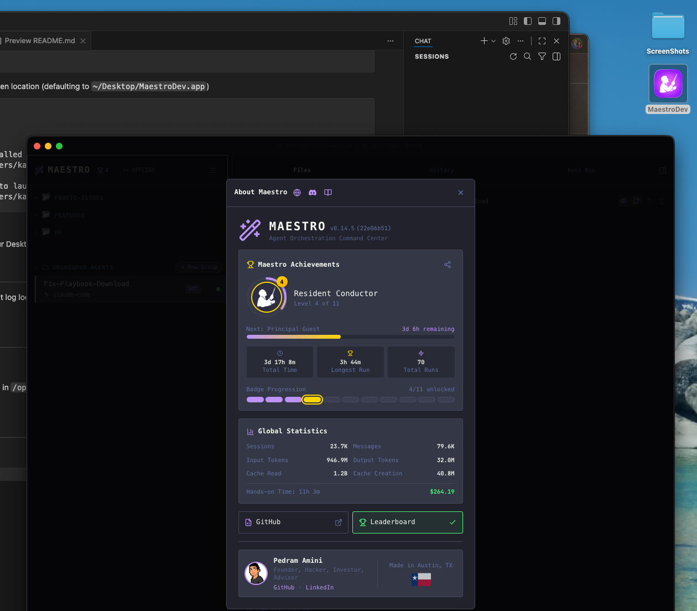

# 🎼 Maestro Launcher

> A macOS application launcher for [Maestro](https://github.com/pedramamini/Maestro) development that runs your worktree in a dev server.

Quickly launch and test your Maestro development environment with a single double-click! Perfect for working with [Maestro Playbooks](https://github.com/pedramamini/Maestro-Playbooks) in a live development environment.

## What It Does

This creates a double-clickable macOS `.app` bundle that:

- Navigates to your Maestro worktree directory
- Sets up a Python virtual environment (if needed)
- Installs npm dependencies
- Resets `package-lock.json` to avoid uncommitted changes
- Starts the main Vite dev server on a configurable port (default: 5198)
- Starts the web interface dev server on a configurable port (default: 5199)
- Monitors the Electron process and cleans up both dev servers when you close the window

## Setup

1. **Configure your worktree path**

   Copy the example configuration and edit it:

   ```bash
   cp config-example.sh config.sh
   # Edit config.sh with your settings
   ```

   Set `MAESTRO_WORKTREE_DIR` to your Maestro worktree location:

   ```bash
   MAESTRO_WORKTREE_DIR="$HOME/src/worktrees/Maestro/preview"
   ```

   Optionally, you can also customize:
   - `DESKTOP_APP_PATH` - Install location (default: `~/Desktop/MaestroDev.app`)
   - `VITE_PORT` - Main renderer dev server port (default: `5198`)
   - `VITE_WEB_PORT` - Web interface dev server port (default: `5199`)
   - `LOG_FILE` - Log file location (default: `$MAESTRO_WORKTREE_DIR/MaestroDev.log`)

2. **Install the launcher**

   ```bash
   ./maestro-launcher --install
   ```

   This will copy the launcher to your chosen location (defaulting to `~/Desktop/MaestroDev.app`)

   ```text
   📦 Creating MaestroDev.app...

   ✅ Installation complete!

      App installed to: /Users/kayvan/Desktop/MaestroDev.app
      Configured for:   /Users/kayvan/src/worktrees/Maestro/preview
      Log file:         /Users/kayvan/src/worktrees/Maestro/preview/MaestroDev.log

   🚀 Double-click MaestroDev.app to launch!
   ```

3. **Launch Maestro**

   Double-click `MaestroDev.app` on your Desktop!

   

## Managing the Launcher

The `maestro-launcher` CLI provides several commands:

```bash
./maestro-launcher --install     # Install MaestroDev.app to your Desktop
./maestro-launcher --uninstall   # Remove MaestroDev.app from your Desktop
./maestro-launcher --update      # Update existing installation with latest scripts
./maestro-launcher --help        # Show help message
```

Use `--update` after pulling new changes from this repository to update your installed app with the latest launcher scripts.

## Logs

All output is logged for debugging. The default log location is `MaestroDev.log` inside your worktree directory, but you can customize this in `config.sh`.

## Requirements

- macOS
- A Maestro git worktree
- Homebrew (with `uv` and `npm` available in `/opt/homebrew/bin`)
- Node.js and Python 3.11

## How It Works

The `.app` bundle structure:

```text
MaestroDev.app/
├── Contents/
│   ├── Info.plist          # App metadata
│   ├── MacOS/
│   │   └── launch.sh       # Main launch script
│   └── Resources/
│       └── icon.icns       # App icon
└── config.sh               # Configuration (copied during install)

```

The launcher reads configuration from `config.sh` which is copied into the app bundle during installation.

## Related Projects

- **[Maestro](https://github.com/pedramamini/Maestro)** - Agent Orchestration Command Center
- **[Maestro Playbooks](https://github.com/pedramamini/Maestro-Playbooks)** - Collection of playbooks for Maestro

## License

This project is covered by the [MIT License](./LICENSE).

See the main [Maestro repository](https://github.com/pedramamini/Maestro) for Maestro's license information.
